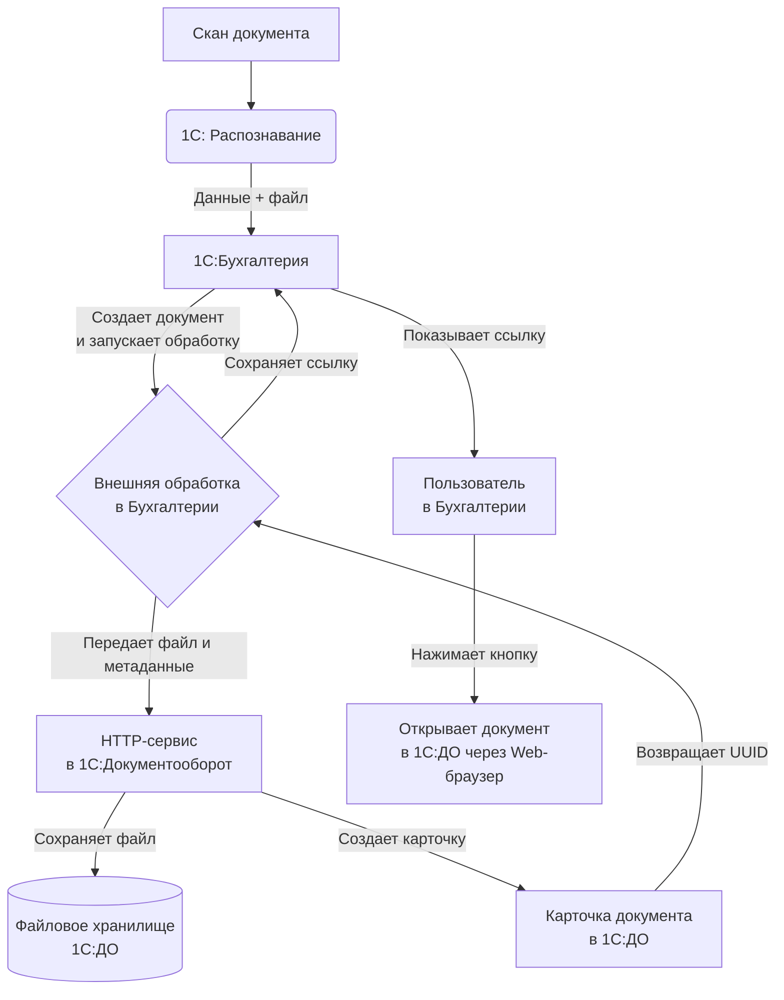

# Предложения по построению сквозного цифрового контура работы с первичными документами и организации их хранения вне базы ведения регламентированного учёта

### Предлагаемое решение и общая схема работы:
1.  Документ поступает в «1С:Бухгалтерия» через «1С:Распознавание».
2.  Распознанные данные автоматически проводятся в бухучете.
3.  **Оригинал изображения/файла** не остается в «Бухгалтерии», а сразу переносится в «Документооборот».
4.  В «Бухгалтерии» остается только **ссылк**а на этот файл в «ДО», обеспечивая быстрый доступ для просмотра. (Это разгружает базу «Бухгалтерии» от тяжелых файлов и дает все преимущества СЭД («1С:ДО») для управления документами: версионность, безопасность, маршрутизация, полный текстовый поиск.)

**Схема процесса:**


---

### Шаг 0: Предварительные настройки и требования

1.  **Версии и лицензии**: Все продукты («Бухгалтерия», «Распознавание», «Документооборот») должны иметь совместимые версии (например, редакция 4.x) и на них есть действующие лицензии.
2.  **Сетевая инфраструктура**:
    *   Обе базы («Бухгалтерия» и «ДО») должны быть установлены в клиент-серверном режиме на СУБД (MS SQL, PostgreSQL).
    *   Серверы приложений 1С должны быть доступны друг другу по сети.
    *   Желательно наличие статических IP-адресов или DNS-имен для серверов.

### Шаг 1: Настройка «1С:Документооборот» (подготовка «приемника»)

1.  **Настройка файлового хранилища в «1С:ДО»** (Администрирование -> Настройки системы -> Хранилище файлов). Рекомендуется использовать **S3-совместимое хранилище** (Yandex Cloud Storage, S3 от Selectel и т.д.). Это надежнее и производительнее сетевой папки.
2.  **Создание структуры папок** для хранения бухгалтерских документов. Например:
    *   `Первичные документы`
        *   `2025`
            *   `Поступление товаров и услуг`
            *   `Реализация товаров и услуг`
            *   `Прочее`
    *   Настройка прав доступа на эти папки для роли/группы, в которую входят бухгалтеры/пользователи.
3.  **Создание HTTP-сервис для приема файлов**.
    *   В конфигураторе «1С:ДО» открыть конфигурацию.
    *   Создать новый **HTTP-сервис** (например, `Integration_BS`).
    *   В его модуле опишисать ключевую функцию — `СохранитьПервичныйДокумент`.

**Примерный код функции в HTTP-сервисе «1С:ДО»:**

```bsl
Функция СохранитьПервичныйДокумент()
    
    // 1. Получаем переданные метаданные из заголовков HTTP-запроса
    ИмяФайла = ПолучитьЗаголовок("X-File-Name");
    НомерДок = ПолучитьЗаголовок("X-Doc-Number");
    ДатаДок = ПолучитьЗаголовок("X-Doc-Date");
    КонтрагентИд = ПолучитьЗаголовок("X-Agent-ID"); // Или наименование
    ТипДокБух = ПолучитьЗаголовок("X-Doc-Type"); // Тип документа в бухгалтерии: "Поступление", "Реализация"...
    СуммаДок = ПолучитьЗаголовок("X-Doc-Sum");
    
    // 2. Получаем сам файл (тело запроса)
    ДвоичныеДанныеФайла = ПолучитьТелоЗапросаВВидеДвоичныхДанных();
    
    // 3. Находим или создаем контрагента в «1С:ДО» по переданным данным
    // (Здесь требуется доработка под вашу структуру справочника Контрагентов)
    
    // 4. Создаем карточку документа в «1С:ДО»
    НовыйДокумент = Документы.ВходящийДокумент.СоздатьДокумент();
    НовыйДокумент.Имя = ИмяФайла + " от " + ДатаДок;
    НовыйДокумент.Дата = Дата(ДатаДок);
    НовыйДокумент.Контрагент = НайденныйКонтрагент; // Ссылка на контрагента в «1С:ДО»
    НовыйДокумент.ВидДокумента = ВидыДокументов.ПервичныйБухгалтерскийДокумент; // Предопределенный вид
    
    // 5. Заполняем дополнительные реквизиты (если они созданы)
    НовыйДокумент.Номер = НомерДок;
    НовыйДокумент.Сумма = Число(СуммаДок);
    НовыйДокумент.Комментарий = "Автоматически создан из 1С:Бухгалтерия. Тип: " + ТипДокБух;
    
    // 6. Прикрепляем файл к карточке документа
    Вложение = НовыйДокумент.Вложения.Добавить(ДвоичныеДанныеФайла, ИмяФайла);
    
    // 7. Записываем и проводим документ
    Попытка
        НовыйДокумент.Записать();
        НовыйДокумент.Провести();
    Исключение
        // Обработка ошибок записи
        Возврат ОписатьОшибку("Ошибка при сохранении документа: " + ОписаниеОшибки());
    КонецПопытки;
    
    // 8. Возвращаем Бухгалтерии Уникальный Идентификатор (UUID) созданного документа
    // Это будет ссылка для открытия
    УникальныйИдентификатор = Строка(НовыйДокумент.УникальныйИдентификатор);
    
    Возврат УникальныйИдентификатор;
    
КонецФункции
```

### Шаг 2: Разработка механизма передачи из «1С:Бухгалтерия КОРП»

Создадим **Внешнюю обработку**, которая будет запускаться после успешного распознавания и проведения документа.

1.  **Создать внешнюю обработку** (`ПереносВДокументооборот.epf`). Ее нужно будет вызвать в момент, когда документ уже создан в «Бухгалтерии» на основе распознания.

2.  **Логика обработки**:
    *   Она должна получить из текущего документа (например, «Поступление товаров и услуг») всю необходимую информацию: ссылку на контрагента, номер, дату, сумму.
    *   **Найти файл, который был загружен для распознавания**. Это критический момент. «1С:Распознавание» обычно сохраняет оригинал файла во временное хранилище или в виде вложения в самом документе. Этот файл нужно найти и прочитать.

**Примерный алгоритм в обработке:**
```bsl
// 1. Получаем файл, который был распознан
ПутьКФайлу = ПолучитьПутьКФайлуДляРаспознания(ДокументОбъект); // Эта функция - ваша кастомная разработка
ДвоичныеДанныеФайла = Новый ДвоичныеДанные(ПутьКФайлу);

// 2. Формируем HTTP-запрос к сервису в «1С:ДО»
АдресСервиса = "http://server-doc:80/ut/hs/Integration_BS/SavePrimaryDocument";
HTTPЗапрос = Новый HTTPЗапрос(АдресСервиса);
HTTPЗапрос.УстановитьЗаголовок("Content-Type", "application/octet-stream");
HTTPЗапрос.УстановитьЗаголовок("Authorization", "Basic " + Base64Строка("ПользовательДляОбмена:Пароль"));
// Передаем метаданные в заголовках
HTTPЗапрос.УстановитьЗаголовок("X-File-Name", ИмяФайла);
HTTPЗапрос.УстановитьЗаголовок("X-Doc-Number", ДокументОбъект.Номер);
HTTPЗапрос.УстановитьЗаголовок("X-Doc-Date", Формат(ДокументОбъект.Дата, "ДФ=yyyyMMdd"));
HTTPЗапрос.УстановитьЗаголовок("X-Agent-ID", ДокументОбъект.Контрагент.УникальныйИдентификатор);
HTTPЗапрос.УстановитьЗаголовок("X-Doc-Type", "ПоступлениеТоваров");
HTTPЗапрос.УстановитьЗаголовок("X-Doc-Sum", Формат(ДокументОбъект.СуммаДокумента, "ЧГ="));

// Помещаем файл в тело запроса
HTTPЗапрос.УстановитьТелоИзДвоичныхДанных(ДвоичныеДанныеФайла);

// 3. Отправляем запрос
HTTPСоединение = Новый HTTPСоединение("server-doc", 80);
Ответ = HTTPСоединение.ОтправитьДляОбработки(HTTPЗапрос, 300);

// 4. Обрабатываем ответ
Если Ответ.КодСостояния = 200 Тогда
    УИД_ДокументаВДО = Ответ.ПолучитьТелоКакСтроку();
    // Сохраняем эту ссылку в документ «Бухгалтерии»
    ДокументОбъект.СсылкаНаДокументВДО = УИД_ДокументаВДО;
    ДокументОбъект.Записать();
    Сообщить("Документ перенесен в Документооборот!");
Иначе
    ОшибкаТекст = Ответ.ПолучитьТелоКакСтроку();
    ВызватьИсключение "Ошибка при выгрузке в ДО: " + ОшибкаТекст;
КонецЕсли;
```

3.  **Интегрируйте обработку в процесс работы после распознавания**. Это можно сделать, добавив соответствующую кнопку в форму документа или настроив вызов обработки через **Подписки на события** в конфигурации «Бухгалтерии» (более сложный, но автоматический путь). Например, на событие `ПриЗаписи` документа проверять, если поле `СсылкаНаДокументВДО` не заполнено, и тогда запускать процесс переноса.

### Шаг 3: Организация просмотра документа из «1С:Бухгалтерия»

Теперь в документе «Бухгалтерии» хранится `УникальныйИдентификатор (UUID)` документа из «ДО».

1.  **Добавьте в нужные документы («Поступление», «Реализация» и т.д.) реквизит** `СсылкаНаДокументВДО` (тип Строка).
2.  **Добавьте в форму документа кнопку «Открыть в Документообороте»**.
3.  **Код для этой кнопки**:

```bsl
Процедура ОткрытьВДокументообороте(СсылкаНаДокументВДО)
    // Формируем прямую URL-ссылку на карточку документа в веб-клиенте «1С:ДО»
    // Формат: http://<СерверДО>/ut/#e?n=<ИмяДокумента>&uid=<UUID>
    БазовыйURL = "http://server-doc/ut/"; // URL веб-доступа к вашему «1С:ДО»
    ПолныйURL = БазовыйURL + "#e?n=ВходящийДокумент&uid=" + СсылкаНаДокументВДО;
    
    // Запускаем системный браузер пользователя с этой ссылкой
    ЗапуститьПриложение(ПолныйURL);
КонецПроцедуры
```

Пользователь в «Бухгалтерии» будет нажимать кнопку, у него откроется браузер, и он сразу попадет в карточку этого документа в «1С:Документооборот» с возможностью просмотреть файл, историю, версии и т.д.

### Шаг 4: Отладка, тестирование и внедрение

1.  **Тестовый стенд**: Развернуть копии баз на тестовом стенде.
2.  **Протестировать все сценарии**:
    *   Распознавание -> Проведение -> Автоматический перенос.
    *   Обработка ошибок (отключить «1С:ДО», передать неверные данные, попробовать передать огромный файл).
3.  **Написать инструкции для пользователей**: Объяснить бухгалтерам новый процесс. Акцент на то, что оригинал теперь всегда в «ДО», а кнопка «Открыть в Документообороте» — это их инструмент для просмотра.
4.  **Обеспечить поддержку**: На первых порах возможны нюансы. Нужно быть готовым оперативной доработке кода.
